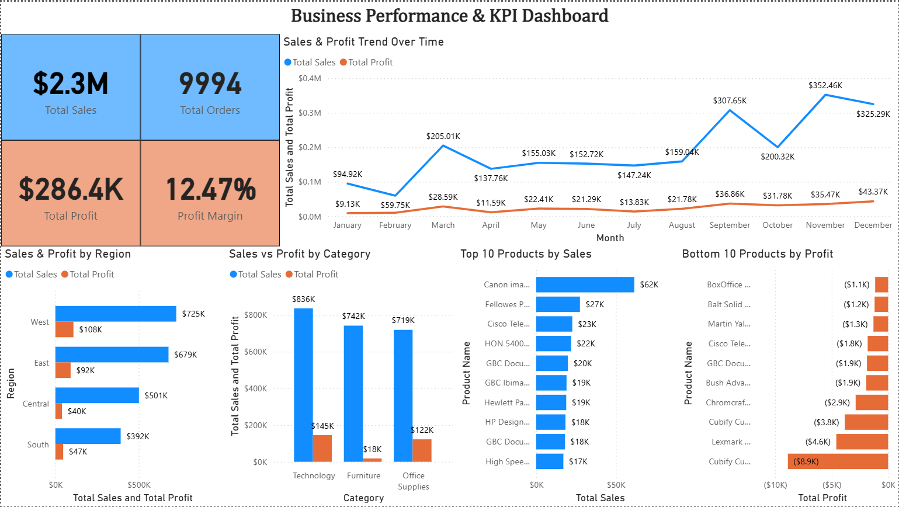

# Business Performance & KPI Dashboard

## 📊 Project Overview
This project presents an advanced Power BI dashboard analyzing business performance using key metrics such as sales, profit, and product-level insights.

---

## 🎯 Objectives
- Monitor overall business performance using KPIs  
- Identify profitable and loss-making segments  
- Analyze trends over time and across regions  
- Provide actionable insights for decision-making  

---

## 🛠️ Tools & Technologies
- Power BI  
- DAX (Data Analysis Expressions)  

---

## 📁 Project Structure

business-performance-dashboard -> data -> dashboard -> images -> README.md

---

## 📊 Dashboard Preview

---

## 📌 Key Insights
- Strong sales growth observed in Q4 indicating seasonal demand  
- Technology category generates highest profit  
- Furniture category shows low profitability despite high sales  
- Several products identified as loss-making, indicating pricing inefficiencies  

---

## 🧠 Analytical Approach
- Developed DAX measures to calculate key KPIs including Total Sales, Total Profit, and Profit Margin  
- Built a structured dashboard to analyze performance across time, regions, categories, and products  
- Conducted trend analysis and identified high-performing and loss-making segments to support business insights  

---

## 🚀 Outcome
Developed a business-focused dashboard that supports data-driven decision-making and highlights key performance drivers.
